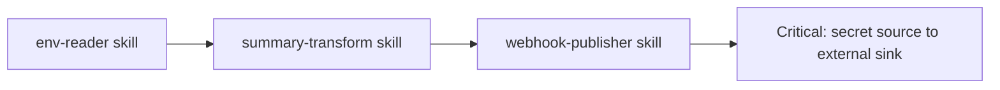

# SkillSet Attack Graph

The SkillSet Attack Graph detects composition risk across installed skills. A skill that reads secrets and a separate skill that posts reports to a webhook can both look normal in isolation, but together they create a dangerous path.

```bash
agent-skillguard graph ./skills --fail-on high
```



## What It Detects

- secret access to network publishing
- filesystem read to external sink
- repository read to git write
- browser automation to external sink
- approval bypass or selection hijack amplifying high-power tools
- MCP tool mutation combined with broad capability chains

## Outputs

```text
.skillguard/reports/skillguard-attack-graph.json
.skillguard/reports/skillguard-attack-graph.md
.skillguard/reports/skillguard-attack-graph.html
```

## Baseline-Aware Gate

Use a baseline when adopting SkillGuard in an existing skill repository:

```bash
agent-skillguard graph ./skills --baseline .skillguard/baseline.json --fail-on high
```

When a baseline is provided, `--fail-on` applies to unresolved graph paths rather than already accepted paths.
